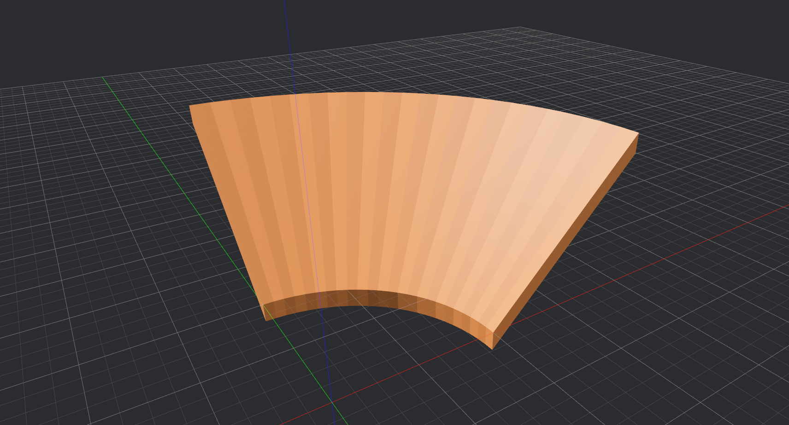

# Curveball

Curve generator for [Neverball] levels

Still in development! I'll publish sometime this week. Until then, don't trust this README.

Curveball is a curve generator tool for [Neverball] level developers.

This repository contains the Curveball curve generator and two programs to access it:

- **curvecat** - a command-line tool
- **curvebird** - a graphical tool

Curveball produces Quake3 map data you can copy and paste into a program like [Trenchbroom].

You can use [curvebird on the web]!

## Features

Curveball generates a wider variety of curves than what is possible with [curve.c].

Curveball currently supports generating these curves:

- Catenary
- Bank
- Rayto
- Serpentine

## Local Installation

First, see if [curvebird on the web] meets your needs.

Both **curvecat** and **curvebird** are hosted on [crates.io], so you can easily compile the latest release from source to install the software.

First, install [Rust](https://www.rust-lang.org/).

To install **curveball**, run `cargo install curveball`.

To install **curvebird**, run `cargo install curvebird`.

If you'd like to make changes, clone the repository.

## Project Structure

Curveball is written in Rust.

This repository is a Cargo workspace with the following crates:

- `curvecat` - Binary crate; compiles to the CLI tool.
- `curvebird` - Binary crate; compiles to the GUI tool.
- `curveball` - Library crate containing functions to generate various curves.

This organization makes `curvecat` faster to compile, since Cargo does not include all the dependencies of `curvebird`.

## Is it any good?

Yes.

## License

Licensed under either of

- [Apache License, Version 2.0](LICENSE-APACHE)
- [MIT License](LICENSE-MIT)

at your option.

[crates.io]: https://crates.io/
[curve.c]: https://github.com/Neverball/neverball/blob/master/contrib/curve.c
[curvebird on the web]: https://www.google.com
[Neverball]: https://neverball.org/
[Trenchbroom]: https://trenchbroom.github.io/

### Notice

Future versions may be released under a different license. [Neverball] is licensed under the terms of GPLv2, so if Curveball ever makes use of [Neverball] assets or code, it will need to be released under a GPL license, too.

A license change will result in a major version bump.
