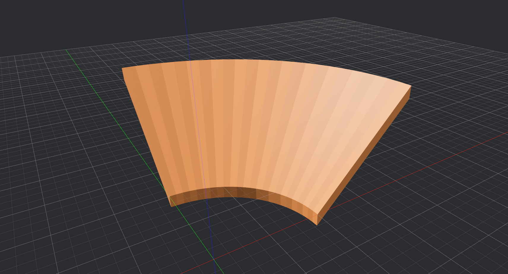

# Curveball

Curve generator for [Neverball] levels

## Still in development! I'll publish soon... Until then, don't trust the README.

Curveball is a curve generator tool for [Neverball] level developers.

This repository contains the Curveball curve generator and two programs to access it:

- **curveball** - a graphical tool
- **curveball-tty** - a command-line tool

Curveball produces Quake3 map data you can copy and paste into a program like [Trenchbroom].

You can use [Curveball on the Web]!

## Features

Curveball generates a wider variety of curves than what is possible with [curve.c].

Curveball currently supports generating these curves:

- curve-classic
- curve-slope
- catenary
- bank
- rayto
- serpentine

## Local Installation

First, see if [Curveball on the Web] meets your needs.

Both **curveball** and **curveball-tty** are hosted on [crates.io], so you can easily compile the latest release from source to install the software.

First, install [Rust](https://www.rust-lang.org/).

To install **curveball**, run `cargo install curveball`.

To install **curveball-tty**, run `cargo install curveball-tty`.

You can also use Cargo to install directly from this repository.

## Project Structure

Curveball is written in Rust.

This repository is a Cargo workspace with the following crates:

- `curveball` - Binary crate; compiles to the GUI tool.
- `curveball-tty` - Binary crate; compiles to the CLI tool.
- `curveball-lib` - Library crate containing functions to generate the various curves.

This organization makes `curveball-tty` faster to compile since Cargo does not include all the dependencies of the GUI application.

## Is it any good?

Yes.

## License

Licensed under either of

- [Apache License, Version 2.0](LICENSE-APACHE)
- [MIT License](LICENSE-MIT)

at your option.

### Notice

Future versions may be released under a different license. [Neverball] is licensed under the terms of GPLv2, so if Curveball ever makes use of [Neverball] assets or code, it will need to be released under a GPL license, too.

A license change will result in a major version bump.

[crates.io]: https://crates.io/
[curve.c]: https://github.com/Neverball/neverball/blob/master/contrib/curve.c
[Curveball on the Web]: https://www.google.com
[Neverball]: https://neverball.org/
[Trenchbroom]: https://trenchbroom.github.io/
